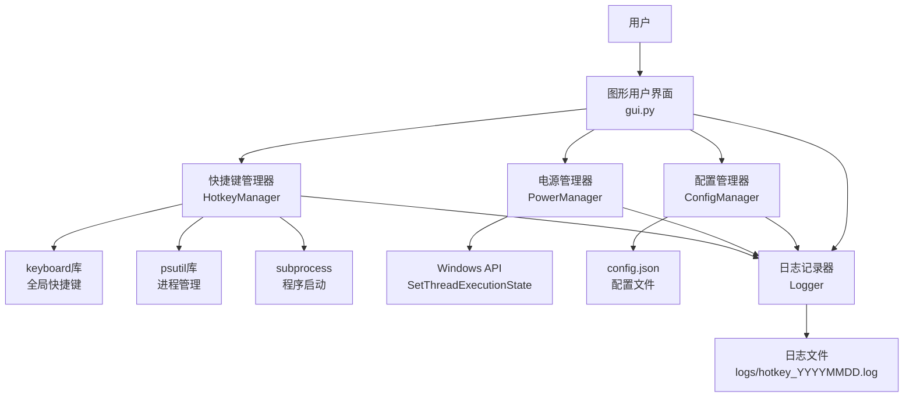

# 设计文档 - 快捷键启动与防休眠工具

## 概述

本系统是一个基于Python的Windows桌面应用程序，采用模块化架构设计。系统由五个核心模块组成：快捷键管理器（HotkeyManager）、电源管理器（PowerManager）、配置管理器（ConfigManager）、日志记录器（Logger）和图形用户界面（GUI）。

系统使用`keyboard`库实现全局快捷键监听，使用`psutil`库进行进程管理，使用`ctypes`调用Windows API实现防休眠功能，使用`tkinter`构建图形界面。

## 架构

### 系统架构图



### 模块职责

1. **GUI (gui.py)**: 用户交互界面，协调各模块工作
2. **HotkeyManager (hotkey_manager.py)**: 快捷键注册、监听和程序启动
3. **PowerManager (power_manager.py)**: 系统休眠状态控制
4. **ConfigManager (config_manager.py)**: 配置文件读写
5. **Logger (logger.py)**: 统一日志记录（单例模式）

## 组件与接口

### 1. HotkeyManager 类

**职责**: 管理全局快捷键注册、监听和目标程序启动

**属性**:
```python
hotkeys: Dict[str, str]              # 快捷键 -> 程序路径映射
running_processes: List[psutil.Process]  # 运行中的进程列表
is_running: bool                     # 监听状态标志
logger: Logger                       # 日志记录器实例
```

**方法**:
```python
def add_hotkey(hotkey: str, program_path: str) -> bool
    """
    添加快捷键绑定
    参数:
        hotkey: 快捷键字符串（如 "ctrl+alt+n"）
        program_path: 目标程序的完整路径
    返回: 成功返回True，失败返回False
    """

def remove_hotkey(hotkey: str) -> bool
    """
    移除快捷键绑定
    参数:
        hotkey: 要移除的快捷键字符串
    返回: 成功返回True，失败返回False
    """

def launch_program(program_path: str) -> None
    """
    启动目标程序（检查是否已运行）
    参数:
        program_path: 程序完整路径
    """

def start() -> None
    """
    启动快捷键监听
    - 注册所有快捷键到keyboard库
    - 启动进程监控线程
    """

def stop() -> None
    """
    停止快捷键监听
    - 注销所有快捷键
    - 停止监控线程
    """

def get_running_count() -> int
    """
    获取当前运行的程序数量
    返回: 活跃进程数量
    """

def _monitor_processes() -> None
    """
    私有方法：后台线程，每5秒清理已结束的进程
    """
```

### 2. PowerManager 类

**职责**: 控制系统休眠状态

**属性**:
```python
is_preventing_sleep: bool  # 当前是否处于防休眠状态
logger: Logger             # 日志记录器实例
```

**Windows API常量**:
```python
ES_CONTINUOUS = 0x80000000       # 持续生效
ES_SYSTEM_REQUIRED = 0x00000001  # 系统保持唤醒
ES_DISPLAY_REQUIRED = 0x00000002 # 显示器保持唤醒
```

**方法**:
```python
def prevent_sleep() -> None
    """
    启用防休眠模式
    调用: SetThreadExecutionState(ES_CONTINUOUS | ES_SYSTEM_REQUIRED | ES_DISPLAY_REQUIRED)
    """

def allow_sleep() -> None
    """
    恢复系统休眠功能
    调用: SetThreadExecutionState(ES_CONTINUOUS)
    """

def __del__() -> None
    """
    析构函数：确保程序退出时恢复休眠功能
    """
```

### 3. ConfigManager 类

**职责**: 配置文件的持久化存储和加载

**属性**:
```python
config_file: Path          # 配置文件路径
config: Dict               # 内存中的配置数据
logger: Logger             # 日志记录器实例
```

**配置文件格式**:
```json
{
  "hotkeys": {
    "ctrl+alt+n": "C:\\Program Files\\Notepad++\\notepad++.exe",
    "ctrl+shift+t": "C:\\Windows\\System32\\cmd.exe"
  }
}
```

**方法**:
```python
def load() -> None
    """
    从config.json加载配置
    - 文件不存在时创建默认配置
    - 文件损坏时记录错误并创建新配置
    """

def save() -> None
    """
    保存配置到config.json
    - 使用UTF-8编码
    - 格式化输出（indent=2）
    """

def get_hotkeys() -> Dict[str, str]
    """
    获取所有快捷键配置
    返回: 快捷键字典
    """

def add_hotkey(hotkey: str, program_path: str) -> None
    """
    添加快捷键并立即保存
    """

def remove_hotkey(hotkey: str) -> None
    """
    移除快捷键并立即保存
    """
```

### 4. Logger 类

**职责**: 统一的日志记录（单例模式）

**属性**:
```python
_instance: Logger          # 单例实例
logger: logging.Logger     # Python logging对象
```

**日志配置**:
- 日志级别: INFO
- 日志格式: `%(asctime)s [%(levelname)s] %(message)s`
- 输出目标: 文件 + 控制台
- 文件命名: `logs/hotkey_YYYYMMDD.log`
- 编码: UTF-8

**方法**:
```python
def __new__(cls) -> Logger
    """
    单例模式实现：确保全局只有一个Logger实例
    """

def _initialize() -> None
    """
    初始化日志系统
    - 创建logs目录
    - 配置日志处理器
    """

def info(message: str) -> None
def warning(message: str) -> None
def error(message: str) -> None
def debug(message: str) -> None
```

### 5. HotkeyManagerGUI 类

**职责**: 图形用户界面和用户交互

**属性**:
```python
root: tk.Tk                        # 主窗口
hotkey_manager: HotkeyManager      # 快捷键管理器
power_manager: PowerManager        # 电源管理器
config_manager: ConfigManager      # 配置管理器
logger: Logger                     # 日志记录器
is_monitoring: bool                # 监听状态
```

**UI组件**:
- 控制面板: 启动/停止按钮、状态标签、进程计数标签
- 快捷键列表: TreeView表格显示所有配置
- 添加面板: 快捷键输入框、程序路径输入框、浏览按钮
- 操作按钮: 添加、删除

**方法**:
```python
def _setup_ui() -> None
    """创建UI组件"""

def _load_config() -> None
    """启动时加载配置到界面"""

def _browse_file() -> None
    """打开文件选择对话框"""

def _add_hotkey() -> None
    """添加快捷键配置"""

def _remove_hotkey() -> None
    """删除选中的快捷键"""

def _toggle_monitoring() -> None
    """切换监听状态（启动/停止）"""

def _update_status() -> None
    """后台线程：每2秒更新状态显示和防休眠控制"""

def _on_closing() -> None
    """窗口关闭事件处理"""

def run() -> None
    """启动GUI主循环"""
```

## 数据模型

### 配置数据结构

```python
Config = {
    "hotkeys": Dict[str, str]  # 快捷键 -> 程序路径
}
```

**示例**:
```json
{
  "hotkeys": {
    "ctrl+alt+n": "C:\\Program Files\\Notepad++\\notepad++.exe",
    "ctrl+shift+c": "C:\\Windows\\System32\\calc.exe",
    "win+t": "C:\\Program Files\\Terminal\\wt.exe"
  }
}
```

### 快捷键格式规范

**格式**: `modifier1+modifier2+...+key`

**支持的修饰键**:
- `ctrl`: Control键
- `alt`: Alt键
- `shift`: Shift键
- `win`: Windows键

**示例**:
- `ctrl+alt+n`
- `ctrl+shift+t`
- `win+e`
- `ctrl+alt+shift+f1`

**验证规则**:
1. 必须包含至少一个修饰键
2. 使用加号(+)连接
3. 不区分大小写
4. 按键名称必须是keyboard库支持的有效按键

### 进程数据结构

```python
running_processes: List[psutil.Process]
```

每个进程对象包含:
- `pid`: 进程ID
- `name()`: 进程名称
- `exe()`: 可执行文件路径
- `is_running()`: 是否仍在运行

## 正确性属性

*属性是关于系统应该满足的特征或行为的形式化陈述，这些陈述应该在所有有效执行中都成立。属性是人类可读规范和机器可验证正确性保证之间的桥梁。*

### 属性 1: 配置持久化往返一致性

*对于任何*有效的快捷键配置字典（包含Unicode字符如中文路径），保存到JSON文件后再加载应该得到等价的配置数据，且所有字符保持完整性

**验证: 需求 4.1, 4.2, 4.5**

### 属性 2: 进程监控准确性

*对于任何*时刻，`get_running_count()`返回的数量应该等于`running_processes`列表中仍在运行的进程数量，且列表应该实时反映进程的启动和结束

**验证: 需求 9.1, 9.3, 9.4**

### 属性 3: 防休眠状态一致性

*对于任何*系统状态，当且仅当运行中程序数量大于0时，`is_preventing_sleep`应该为True且Windows API应该被调用以防止休眠

**验证: 需求 3.1, 3.2**

### 属性 4: 重复启动防护

*对于任何*已在运行的程序，再次触发其快捷键不应该创建新的进程实例，系统应该检测到程序已运行

**验证: 需求 2.2**

### 属性 5: 快捷键格式验证

*对于任何*快捷键字符串，如果它不包含至少一个修饰键（ctrl/alt/shift/win），系统应该拒绝添加并返回False

**验证: 需求 1.1, 10.5**

### 属性 6: 快捷键大小写不敏感

*对于任何*快捷键字符串，"Ctrl+Alt+N"和"ctrl+alt+n"应该被视为相同的快捷键

**验证: 需求 10.4**

### 属性 7: 文件类型限制

*对于任何*程序路径，如果文件扩展名不是.exe，系统应该拒绝添加

**验证: 需求 2.5**

### 属性 8: 日志记录完整性

*对于任何*重要操作（快捷键注册、程序启动、防休眠状态变化、错误），都应该有对应的日志条目被写入日志文件

**验证: 需求 2.3, 3.3, 6.1, 6.2**

### 属性 9: Logger单例一致性

*对于任何*时刻，多次创建Logger实例应该返回同一个对象引用

**验证: 需求 7.5**

### 属性 10: GUI状态同步

*对于任何*监听状态变化，GUI显示的状态标签文本、按钮文本和进程计数应该与`is_monitoring`状态和`get_running_count()`返回值一致

**验证: 需求 5.5, 5.6, 5.7, 5.8**

### 属性 11: 快捷键注册完整性

*对于任何*配置的快捷键集合，当启动监听时，所有快捷键都应该被成功注册到keyboard库

**验证: 需求 1.3**

## 错误处理

### 错误类型与处理策略

1. **文件系统错误**
   - 配置文件不存在: 创建默认配置
   - 配置文件损坏: 记录错误，创建新配置
   - 程序路径无效: 拒绝添加，提示用户
   - 日志目录创建失败: 仅输出到控制台

2. **进程管理错误**
   - 程序启动失败: 记录错误，继续运行
   - 进程访问被拒绝: 忽略该进程，继续监控
   - 进程不存在: 从监控列表移除

3. **快捷键注册错误**
   - 快捷键已被占用: 记录警告，尝试注册
   - 快捷键格式错误: 拒绝添加，提示用户
   - 注册失败: 记录错误，跳过该快捷键

4. **Windows API错误**
   - SetThreadExecutionState失败: 记录错误，继续运行
   - 权限不足: 记录警告，功能可能受限

5. **GUI错误**
   - 用户输入为空: 显示警告对话框
   - 操作失败: 显示错误对话框
   - 操作成功: 显示成功提示

### 异常处理原则

1. **非致命错误**: 记录日志，继续运行
2. **致命错误**: 记录日志，清理资源，退出程序
3. **用户错误**: 显示友好提示，不记录为错误
4. **资源清理**: 使用析构函数和关闭事件确保清理

## 测试策略

### 单元测试

针对每个模块编写单元测试，验证特定功能：

1. **ConfigManager测试**
   - 测试配置文件创建
   - 测试配置保存和加载
   - 测试UTF-8编码处理
   - 测试损坏文件处理

2. **HotkeyManager测试**
   - 测试快捷键添加和移除
   - 测试程序启动逻辑
   - 测试重复启动检测
   - 测试进程监控

3. **PowerManager测试**
   - 测试防休眠启用
   - 测试休眠恢复
   - 测试析构函数清理

4. **Logger测试**
   - 测试单例模式
   - 测试日志文件创建
   - 测试不同级别日志记录

### 属性测试

使用属性测试库（如Hypothesis）验证通用属性：

1. **配置往返测试** (属性1)
   - 生成随机配置数据
   - 保存后加载，验证一致性
   - 最少100次迭代

2. **快捷键唯一性测试** (属性2)
   - 生成随机快捷键配置
   - 验证每个快捷键只映射一个路径
   - 最少100次迭代

3. **进程计数准确性测试** (属性3)
   - 模拟进程启动和结束
   - 验证计数与实际一致
   - 最少100次迭代

4. **防休眠状态测试** (属性4)
   - 生成随机进程数量
   - 验证防休眠状态正确
   - 最少100次迭代

5. **快捷键格式验证测试** (属性7)
   - 生成各种格式的快捷键字符串
   - 验证无修饰键的被拒绝
   - 最少100次迭代

6. **编码一致性测试** (属性8)
   - 生成包含各种Unicode字符的路径
   - 验证保存加载后字符完整
   - 最少100次迭代

### 集成测试

测试模块间协作：

1. **完整工作流测试**
   - 启动GUI → 添加快捷键 → 启动监听 → 触发快捷键 → 验证程序启动 → 验证防休眠

2. **配置持久化测试**
   - 添加配置 → 重启程序 → 验证配置加载

3. **资源清理测试**
   - 启动监听 → 关闭程序 → 验证快捷键注销 → 验证休眠恢复

### 测试配置

- **属性测试迭代次数**: 最少100次
- **测试框架**: pytest + Hypothesis
- **测试标签格式**: `# Feature: hotkey-power-manager, Property {N}: {property_text}`
- **覆盖率目标**: 核心逻辑 > 80%

### 测试注意事项

1. **Windows依赖**: 某些测试需要在Windows环境运行
2. **权限要求**: 全局快捷键测试可能需要管理员权限
3. **模拟策略**: 使用mock模拟Windows API调用
4. **隔离性**: 测试不应影响系统实际休眠状态
5. **清理**: 每个测试后清理注册的快捷键和配置文件
